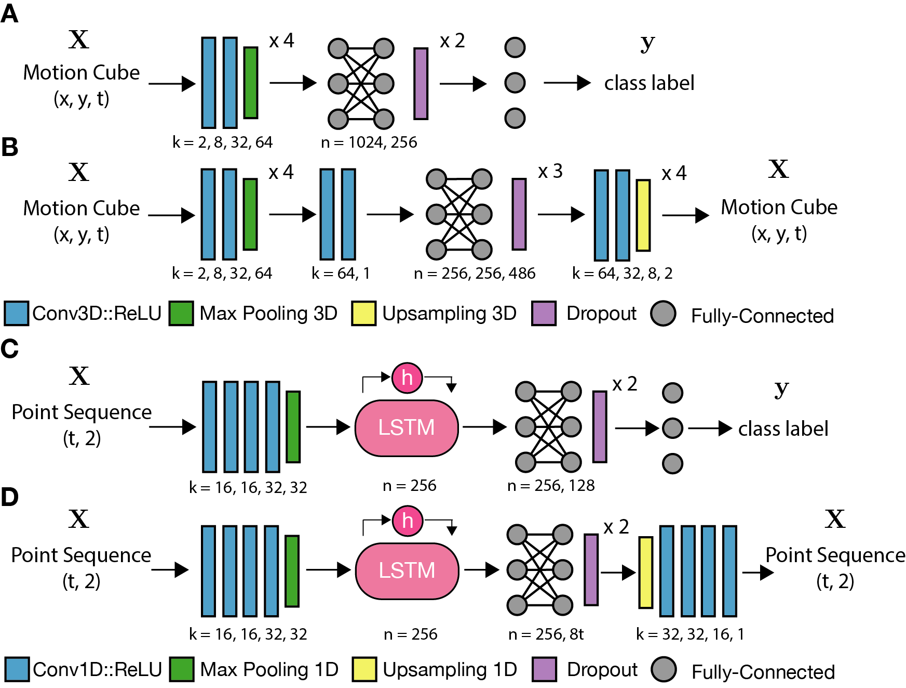
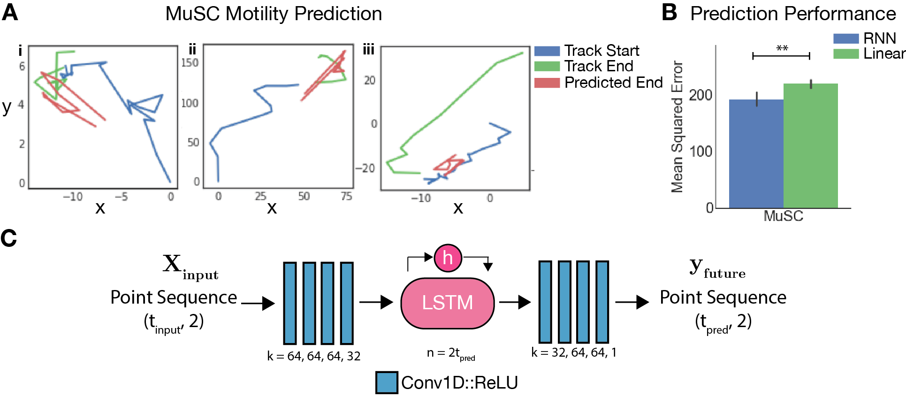

# Lanternfish

`Lanternfish` is a set of software tools to analyze motion data with convolutional neural networks (CNNs). `Lanternfish` contains networks and tools to analyze motion using two approaches: (1) explicit 3D representations of motion analyzed with 3D CNNs, and (2) multi-channel time series representations of motion analyzed with 1D convolutional-recurrent neural networks (RNNs). `Lanternfish` includes CNN architectures suitable for classification and unsupervised learning of motion features by autoencoding with both of these approaches.

We've published a pre-print applying `Lanternfish` in the context of myogenic activation and neoplastic transformation. [Check it out on bioRxiv](https://www.biorxiv.org/content/early/2018/02/09/159202) for in depth explanations and a demonstration of applications.

**Pre-print:** [Deep convolutional and recurrent neural networks for cell motility discrimination and prediction](https://www.biorxiv.org/content/early/2018/02/09/159202)

## Lanternfish Core Features

### 3D CNN and RNN Architectures

Lanternfish contains four core CNN architectures: (1) a 3D CNN classifier, (2) a 3D CNN autoencoder, (3) an RNN classifier, and (4) an RNN autoencoder. These architectures are schematized below.

Models are found in `bestiary.py`.

### Conversion of motion paths into 3-dimensional images

2-dimensional motion paths are converted into 3-dimensional images with dimensions `(x, y, time)`. Each timepoint in the series is represented by a slice of the resulting 'motion cube.' Each slice marks the location of the object at the corresponding timepoint as the center of an anisotropic kernel.

A typical kernel may be a Gaussian with a broad `sigma` and a unit depth in the time domain. The magnitude `mu` of the kernel may be specified independently at each timepoint to allow for an additional information parameter to be encoded within the motion cube. Encoding the instantaneous speed of an object as the `mu` parameter tends to be useful for general classification tasks. `Lanternfish` also contains tools to specify a truly dynamic kernel for each timepoint, for instance encoding an additional parameter as `sigma`, by convolution on either CPUs or CUDA capable GPUs.

Motion cube generation tools also include the option to compress or crop collected tracks. This feature is useful to deal with limited GPU memory for downstream CNN training. Compression is performed by simple division and rounding of path coordinates, reducing the number of pixels required to represent the full field-of-view in each slice of a motion cube. Cropping allows for removal of a minority of paths that require much larger fields of view to fit, preventing a few outliers from 'diluting' the other motion cubes with empty space.

Motion cube generation tools are found in `motion_cube.py` and `motcube_preprocessing.py`.

### Cell Mimetic Simulations of Motion and Transfer Learning

`Lanternfish` contains tools to simulate motion that mimics a sample of heterogeneous motion phenotypes, referred to as "cell mimesis". Sample motility behaviors are mimicked by decomposing the observed behavior into a set of *k* clusters based on displacement and directionality features, then simulating each of these clusters by fitting a Johnson distribution to displacement and turn angle observations within the cluster. Simulations are generated from each cluster proportional to their representation in the original sample.

Cell mimesis tools are found in `cell_mimesis.py`

### Cell Motility Prediction

`Lanternfish` includes RNN sequence-to-sequence architectures for prediction of future cell motility behaviors based on past behaviors. These models learn to predict the subsequent steps in a cell's motility path from past steps, and demonstrate performance superior to linear models in muscle stem cells.

These models can be found in `bestiary.py`, and the linear baseline in `linear_pred.py`.

